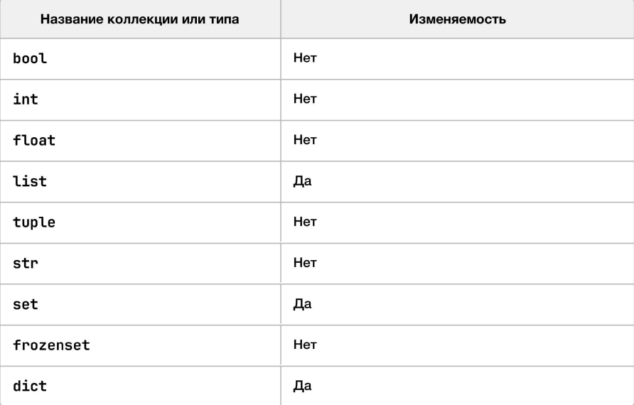
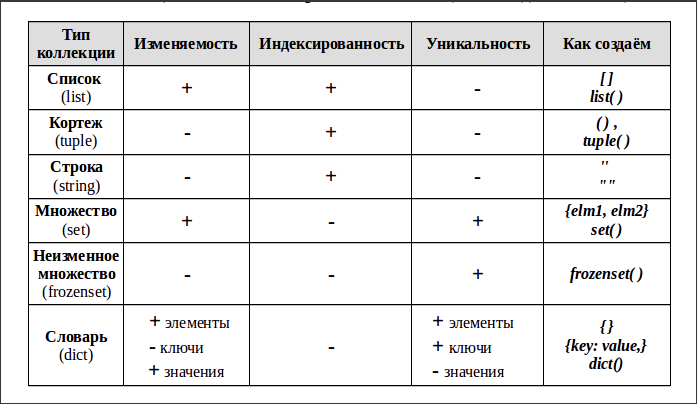

# **Коллекции.**

**Коллеции и их виды:**

Что такое коллеции в языке Python?

**Коллекции** - программный объект (**переменная-контейнер**), хранящая набор                  
значений одного или различных типов, позволяющий обращаться к этим                
значениям, а также применять специальные функции и методы,                
зависящие от типа коллекции.


Наши коллекции дробятся на такие категории, как:

* **Последовательности**
* **Множества**
* **Отображения**

Все виды коллекций:

* **Список** - `list()`
* **Кортеж** - `tuple()`
* **Множество** - `set()`
* **Неизменяемое множество** - `frozenset()`
* **Словарь** - `dict()`

И так же между собой все эти категории делятся на **изменяемые** и **неизменяемые**              
коллекции.

**Изменяемые** – коллекции, которые можно изменить в любой момент               
времени.

**Неизменяемые** – коллекции, которые изменить нельзя, но можно                   
пересоздать.


**Строки** тоже в какой-то степени можно считать коллекцией, т.к. они              
хранят последовательность символов. Но строки - это базовый тип, к тому                 
же в коллекциях также можно хранить строки, поэтому принято их к                
коллекциям не относить                  

Небольшая подсказка по изменяемости и неизменяемости:



---


```python
my_list = [] # = list()
my_tuple = () # = tuple()
'' "" """""" ''''''
my_set = {} # не прокатит
my_frozenset = {} # так же не прокатит
my_dict = {} # = dict()
```

Давайте так же посмотрим с вами на общие свойства наших встроенных коллекций:              





Так же давайте освежим наши знания о том, что у нас за страшные термины такие:               
**изменяемость**, **индексированность** и **уникальность**:

* **Изменяемость** коллекции — позволяет добавлять в коллекцию новых членов или            
удалять их после создания коллекции.

* **Индексированность** – каждый элемент коллекции имеет свой порядковый номер —                
индекс(**НАЧИНАЕТСЯ С НУЛЯ!**). Это позволяет обращаться к элементу по его              
порядковому индексу, проводить слайсинг(**«нарезку»**) — брать часть                
коллекции выбирая исходя из их индекса.

**Уникальность** – каждый элемент коллекции может встречаться в ней только один            
раз. Это порождает требование неизменности используемых типов данных для               
каждого элемента, например, таким элементом не может быть список.

```python
my_list = ['a', 'b', 'c', 1, 4, (1, 2, 3), [1, 2, 2, 3], {"a": 1}]
my_tuple = (1, 'a')
my_set = {1, 2, 3, 4, 5, 6, 7, 8, 9}
my_dict = {
    'a': 1,
    'b': 2,
    'c': 3,
}
my_string = "My awesome string"
```

---

## **Общие подходы к работе с любой коллекцией**

что можно делать с любой стандартной коллекцией независимо от её типа? Есть             
некоторые методы и операции, которые мы можем применять ко всем нашим коллекциям,             
будь то список, кортеж, множество, или что-то ещё(включая строку).

* Печать элементов коллекции с помощью функции `print()`

```python
print(my_list) # ['a', 'b', 'c']
print(my_tuple) # (1, 'a', ["John", "Marry", "Nick"])
print(my_set) # {1, 2, 3, 4, 5, 6, 7, 8, 9}
print(my_dict) # {'a': 1, 'b': 2, 'c': 3}
print(my_string) # My awesome string
```

* Подсчёт количества элементов коллекции с помощью функции `len()`

```python
print(len(my_list)) # 3
print(len(my_tuple)) # 3
print(len(my_set)) # 9
print(len(my_dict)) # 3
print(len(my_string)) # 17 (потому что в строках элементом является один символ, пробел так же считается.)
```

* Проверка принадлежности элемента данной коллекции c помощью оператора `in`

```python
print('a' in my_list)           # True
print('q' in my_list)           # False
print('a' not in my_list)       # False
print('q' not in my_list)       # True

print('a' in my_dict) # True - без указания метода поиск по ключам
print('a' in my_dict.keys()) # True - аналогично примеру выше
print('a' in my_dict.values()) # False - так как 'а' — ключ, не значение
print(1 in my_dict.values()) # True
```

* Обход всех элементов коллекции в цикле `for in`(больше об этом на теме циклов)                

```python
for elem in my_list:
  print(elem)
```

Что ещё есть у нас из обобщённых подходов к коллекциям:

* Функции `min()`, `max()`, `sum()`

```python
new_list = [1, 2, 3, 4, 5, 6, 7, 8, 9]
print(sum(new_list))
print(min(new_list))
print(max(new_list))
```

```python
# Получение средней зп у сотрудников
employees_salary = [1000, 2500, 281, 473, 774]

try:
    average = sum(employees_salary) / len(employees_salary)
    print(f"Средняя зп: {average}")
except ZeroDivisionError:
    print("Список пуст.")
```

---

# **Список**

это стандартная изменяемая коллекция, которая позволяет хранить              
различные типы данных в одном месте и под одним именем.              
Списки можно создавать с помощью слова list либо с помощью               
квадратных скобок.                 

Для создания списка с элементами, можно записать так: функция `list()`                 
может принимать любой другой итерируемый объект:

```python
list_1 = list("hello")
list_2 = ['q', 'w', 'e', 'r', 't', 'y']
```

Благодаря динамической типизации в списках можно хранить разные             
типы данных, т.е. в одном списке одновременно можно хранить и строку,             
и число, и любой другой тип.               

```python
list_values = [True, 'j', 1, "e", 2, "5", None, [1, 4, "a"], {2, 4, 5,}, {"a": 2}]
```

Выводить списки можно с помощью функции `print()`, тогда результат              
вывода является всеми элементами списка        

---

Списки, как и строки, подчиняются **индексированию**

```python
new_list = list_values[:6]
new_list2 = list_values[:-1]
new_list3 = list_values[:-4]
```

Срезы также работают на списках, благодаря им можно получить новый               
список с выборкой данных по числам, передаваемых в срез                 

```python
new_list4 = list_values[1:5]
new_list5 = list_values[7:4:-1]
new_list6 = list_values[::1]
```

Элементы списка можно **изменять**, обратившись к ним по индексу.

```python
new_list_of_values = [1, 2, 3, 4, 5]

new_list_of_values[2] = 300
new_list_of_values[3] = "qwerty"

print(new_list_of_values)
```

Списки можно объединять с помощью оператора `+`

```python
list_val = [1, 2, 3]
list_val_str = ['4', '5', '6']

print(list_val + list_val_str)
```

Так же списки можно разложить благодаря следующему написанию переменных:

```python
new_list_example = [13, 54, 76]

a, b, c = new_list_example

print(a, b, c)
```

**Функция range()**

Функция **range(start, end, step)**, принимает три ключевых                 
параметра и создаёт итерируемый объект - последовательность из чисел,                  
начиная с начала `start`, не включаемого конца `end` и шага `step`                 

С помощью функции **range()** можно создавать списки, состоящие из               
чисел

* Когда передаётся `3` параметра, то это **начало последовательности**,               
**конец** и **шаг**.

* Когда передаётся `2` параметра, то это **начало последовательности** и               
**конец**, а **шаг** передаётся автоматически `1`

* Когда передаётся `1` параметр, то это **конец последовательности**, а              
**начало** – автоматически `0`, **шаг** – автоматически `1`

```python
range_list = list(range(0, 10, 1))
range_list_1 = list(range(7, 20))
range_list_2 = list(range(20))

print(range_list, range_list_1, range_list_2, sep="\n")
```

## **Методы списков**

В наших списках существуют различные методы, которые могут использоваться              
нами в различных задачах. Постараемся рассмотреть самые           
распространённые из них:

* `append()` - Добавляет элемент в конец списка

```python
numbers = [1, 2, 3]
numbers.append(4)
print(numbers)  # [1, 2, 3, 4]
```

---
есть белый список (пустой) и чёрный список гостей. В чёрном списке находится                     
Олег. Он очень плохо себя показал в прошлый раз в заведении.                

Напишите проверку, что если в пользовательском вводе приходит Олег - он НЕ                      
должен попасть в белый список. Учтите регистр и пробелы в начале и конце ввода                
---


* `extend()` - Расширяет список, добавляя элементы из другого           
итерируемого объекта

```python
numbers = [1, 2, 3]
more_numbers = [4, 5, 6]
numbers.extend(more_numbers)
print(numbers)  # [1, 2, 3, 4, 5, 6]
```

---

Пользователь вводит n слов через запятую в двух разных переменных (два ввода)          

Сконвертировать его ввод в списки и к первому списку добавить второй

---

* `insert()` - Вставляет элемент на указанную позицию в списке

```python
fruits = ['apple', 'banana', 'cherry']
fruits.insert(1, "orange")
print(fruits)  # ['apple', 'orange', 'banana', 'cherry']
```

* `remove()` - Удаляет первое вхождение указанного элемента из списка

```python
numbers = [2, 1, 2, 3, 2, 2]
numbers.remove(2)
print(numbers)  # [1, 2, 3, 2, 2]
```

* `pop()` - Удаляет и возвращает элемент по указанному индексу

```python
fruits = ['apple', 'banana', 'cherry']
popped_fruit = fruits.pop(1)
print(popped_fruit)  # 'banana'
print(fruits)  # ['apple', 'cherry']
```

---

Пользователь вводит слова через пробел в одном вводе
Во втором вводе вводит конкретное слово

сконвертировать первый ввод пользователя в список
Удалить введённое слово из этого списка и вывести его отдельно в строке
Учитывать возможные ошибки и пустой ввод

---

* `index()` - Возвращает индекс первого вхождения указанного элемента в списке

```python
numbers = [1, 2, "wah", 3, 2, ["a", "b", -1], (1, 2, 3), "wah"]
index = numbers.index("wah")
print(index)  # 2
```

* `count()` - Возвращает количество вхождений указанного элемента в списке

```python
numbers = [1, 2, 3, 2, 2, 2, 2, 2]
count = numbers.count(2)
print(count)  # 6
```

* `sort()` - Сортирует список по возрастанию

```python
numbers = ["a", "c", "b", "e"]

numbers.sort()
print(numbers)  # ['a', 'b', 'c', 'e']
```

* `reverse()` - Обращает порядок элементов в списке

```python
fruits = ['apple', 'banana', 'cherry']
fruits.reverse()
print(fruits)  # ['cherry', 'banana', 'apple']
```

```python
list1 = [1, 2, 3, 4, 5]
list2 = [4, 5, 6, 7, 8]

# Объединяем списки и удаляем дубликаты через переопределение методом set()
combined_list = list(set(list1 + list2))

print(combined_list)
```

### **Вложенные списки**

это списки, которые хранятся внутри **друг друга**              

Примеры создания вложенных списков, данные внутри них могут
отличаться:

```python
matrix = [
    [1, 2, 3],
    [4, 5, 6],
    [7, 8, 9]
]
```

Вложенные списки классифицируются **по глубине**. Если список внутри               
списка - это **двухмерный список** и его глубина - `2`. Если список в списке               
внутри списка - это **многомерный список** и его глубина - `3`.                      

```python
new_matrix = [
    [[1, 2, 3], [4, 5, 6], [7, 8, 9]],
    [[1, 2, 3], [4, 5, 6], [7, 8, 9]],
    [[1, 2, 3], [4, 5, 6], [7, 8, 9]]
]
```

---

# **Кортежи**

**Кортеж** – это индексированная структура данных, похожая на список,              
предназначенная для безопасного извлечения и отправки данных, а также             
для безопасного их хранения              

**Кортеж** – это неизменяемая коллекция, которая содержит ряд                
преимуществ:

* данные, хранящиеся в кортеже, невозможно изменить, они полностью
защищены от “случайных” изменений;
* кортеж как структура занимает меньший вес в памяти;
* кортеж можно использовать ключом словаря.


Для создания кортежа используются **круглые скобки** либо функция                      
`tuple()`             

Если заключить данные просто в круглые скобки, то кортеж не будет                
создан. Для того, чтобы создать кортеж с одним элементом, нужно                
поставить после него **запятую**. Например: `(1, )` - это **кортеж**.                       

```python
list_ = [1, 2, 3]

my_tuple = tuple(list_)

my_tuple_1 = (4, 5, 6)
```

На кортежи действуют все методы и функции списков, которые не
изменяют данные внутри структуры.


## **Методы Кортежей**

* `count()` - подсчитывает количество вхождений опр. значения в кортеж
* `index()` - возвращает индекс первого вхождения элемента, который          
передаётся в метод

```python
my_tuple = ()
my_tuple_1 = tuple()
```

Где наши кортежи могут применяться?

* **Обработка данных** из базы данных: Кортежи могут быть использованы для            
представления результатов запросов к базе данных. Например, при                
извлечении данных из таблицы можно использовать кортежи для хранения              
значений каждой строки. Методы, такие как `count()` и `index()`, могут               
использоваться для анализа и обработки этих данных.

* **Возвращение** нескольких значений из функции: Функции в Python могут          
возвращать кортежи в качестве результата. Например, функция, которая            
вычисляет минимальное и максимальное значение в списке, может вернуть           
кортеж из двух значений. Затем можно использовать методы кортежей,           
такие как `count()` и `index()`, для работы с этими значениями.

* **Обмен значениями переменных**: Кортежи могут быть использованы для обмена          
значениями между переменными без необходимости использования           
временной переменной.

```python
a = 1
b = 2

print(f"До обмена: a = {a}, b = {b}")

a, b = b, a

print(f"После обмена: a = {a}, b = {b}")
```

* **Кеширование результатов**: Кортежи могут быть использованы в качестве          
ключей словаря для кеширования результатов вычислений. Например, если             
у вас есть функция с дорогостоящими вычислениями, вы можете сохранять               
результаты в словаре с ключами-кортежами аргументов функции. При              
повторных вызовах функции с теми же аргументами, вы можете использовать              
сохраненные значения вместо повторных вычислений.

* **Сопоставление именованных значений**: Кортежи могут использоваться для           
сопоставления именованных значений, когда требуется более сложная структура            
данных, чем просто набор переменных. Например, можно использовать кортежи для           
представления информации о студентах, где каждый кортеж содержит имя, возраст,             
оценки и другую информацию о студенте.
