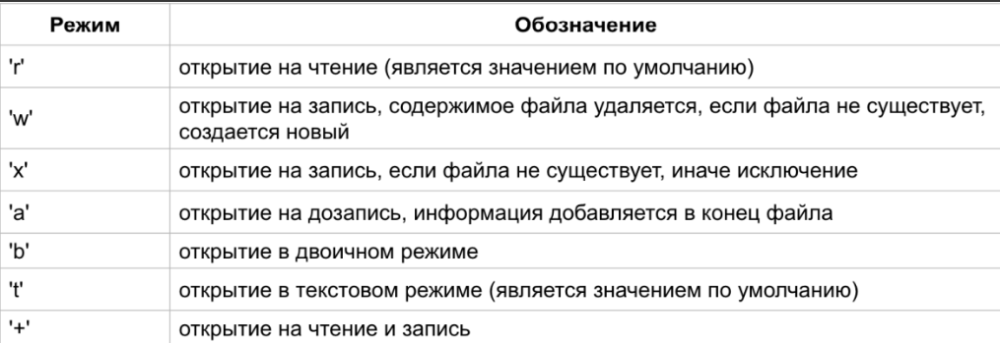
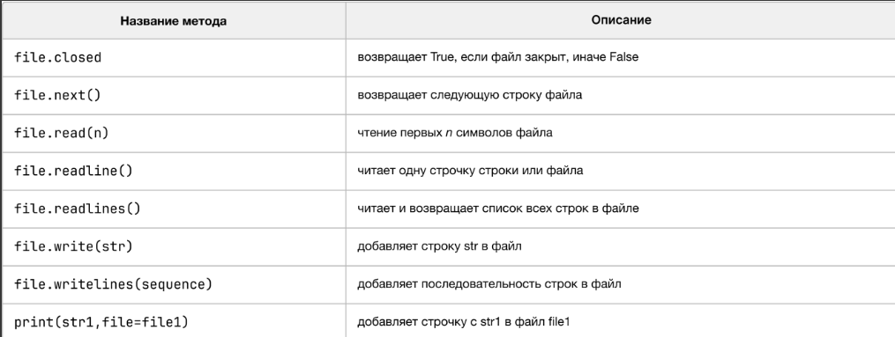

# **Files**

**Файлы** - это наборы данных, хранящиеся на компьютере или других устройствах.              
В программировании файлы играют важную роль, поскольку они позволяют              
программам взаимодействовать с внешним окружением, сохранять и получать                
данные, а также обмениваться информацией между различными программами.                

**Файлы** представляют собой упорядоченные наборы данных, которые могут содержать текст,                  
изображения, видео, аудио или другие форматы данных. Они могут быть сохранены на                     
жестком диске компьютера, съемных носителях (например, USB-флешках) или                       
доступны через сеть (через интернет).                       


Роль файлов в хранении данных заключается в том, что они позволяют программам                  
сохранять и извлекать информацию для дальнейшего использования. Например, файлы                     
могут содержать данные о настройках программы, результаты вычислений, текстовые                     
документы, базы данных и ещё до кучи чего другого.                                 

**Наши с вами файлы могут делиться на две категории:**                                             

1) **Текстовые** - хранят символы и данные в том виде, в котором их                     
внёс кожаный мешок (человек).                     

2) **Бинарные** - хранят биты. В таких файлах данные отображаются в виде байтов                      

Пример **текстового** файла:                                      

---


---

Как видите, данные у нас хранятся в человекочитабельном виде                            

А вот пример того, как выглядит **бинарный файл**.                                
 
---


---

Кожаный его не поймёт, или же очень (ОЧЕНЬ) долго будет понимать-переводить.                                    
Для наших же машин тут всё просто и понятно.                                  

---

### **Зачем нам использовать файлы в нашем программировании?**                           

Всем программам нужно работать с файлами по разным причинам,                                  
вот некоторые из них:                                 

1) **Чтение и обработка входных данных:**                                 

Многие программы требуют входных данных для выполнения своих задач.                      
Файлы могут содержать эти входные данные, и программы могут прочитать                      
данные из файлов для дальнейшей обработки. Например, текстовый файл                   
может содержать список имен пользователей, которые программе                              
нужно обработать.                                     

2) **Запись результатов работы программы:**                                     

После выполнения программы результаты могут быть сохранены в файл, чтобы                 
их можно было использовать позднее или передать другим программам.                       
Например, программа для анализа данных может записать результаты своего                    
анализа в файл CSV для последующего использования в электронной таблице.                       


3) **Хранение и обмен информацией между программами:**                                      

Файлы могут служить средством обмена информацией между разными                       
программами. Одна программа может создать файл с данными, а другая                         
программа может прочитать этот файл и использовать данные в своей                      
работе. Например, веб-приложение может сохранять данные пользователя в                       
файле, который затем может быть прочитан другой программой                         
для обработки или анализа.                                   

 
### **Сферы применения файлов:**                                     

1) **Обработка текстовых данных:**                                     

Программы могут читать текстовые файлы для анализа или обработки текста.                          
Какой-нибудь скриптик в машинном обучении может принимать на вход                     
какой-нибудь **CSV** с большим количеством данных, для обучения на этих данных.                          

2) **Работа с базами данных:**                                

Базы данных часто используются для хранения больших объемов данных.                     
Программы могут читать и записывать данные в базы данных через файлы                    
(какая-нибудь программа учета продаж может использовать файл базы                   
данных для сохранения информации о продажах и клиентах)                                    

3) **Обмен данными с внешними устройствами:**                                   

Файлы могут использоваться для обмена данными с внешними устройствами,                            
такими как считыватели штрих-кодов или устройства измерения. (программа                        
управления складом может использовать файл, чтобы получать данные о                           
товарах, прочитанных с помощью сканера штрих-кодов)                                  

4) **Хранение конфигурационных данных:**                                      

Многие программы используют файлы для хранения настроек и конфигурации.                  
(веб-сервер может использовать файл конфигурации для указания порта, на                       
котором он будет слушать запросы. В проекте будут лежать разного рода                        
файлы конфигураций для настройки работы вашего проекта\приложения.                     
При запуске вашего проекта\приложения система будет лезть в эти                     
файлы, читать конфиг настройки и запускаться)                                                   


**Какие операции с файлами мы можем использовать?**                                  

* **Открытие файла**                               
* **Закрытие файла**                              
* **Чтение \ запись файла**                            

---

# **.TXT файлы**

простейший формат хранения текста, его преимущество в том, что конвертировать его                          
можно практически в любой другой текстовый файл. Однако читать его неудобно                         
из-за того, что форматирование практически отсутствует, шо геморно.                                  

Что ж, давайте разбираться с нашими текстовыми файлами и методами работы с ними                                

**Чтение файлов:**                                  

1) **Открытие файла в режиме чтения:**                            

Для начала чтения файла необходимо открыть его с помощью функции **open()**.                     

Функция **open()** принимает два аргумента: имя файла и режим доступа.                                       
Режим доступа **'r'** указывает, что файл открывается в режиме чтения:                             

```python
my_file = open('example.txt', 'r')
```

**Какие методы чтения есть:**                                 

* **read()** - читает весь файл и возвращает его содержимое в виде строки.                         

```python
content = my_file.read()
print(content)
```

* **readline()** - читает одну строку из файла и возвращает ее. При                            
последовательных вызовах readline() будут читаться следующие строки файла.                            

```python
line = my_file.readline()
print(line)
```

* **readlines()** - читает все строки из файла и возвращает их в виде                       
списка строк. Каждый элемент списка представляет одну строку файла.                             

```python
lines = my_file.readlines()
print(lines)
```

Еще один способ прочитать содержимое файла - это использовать цикл для                            
итерации по файловому объекту. В этом случае каждая итерация                               
возвращает одну строку файла.                                  

```python
for line in my_file:
    print(line.strip())
```

После окончания чтения файла необходимо закрыть его с помощью                            
метода **close()**. Закрытие файла освобождает ресурсы и предотвращает                                 
возможные проблемы при дальнейшей работе с ним.                                  

```python
my_file.close()
```

**Запись в файл:**                                

Запись в файл позволяет программе сохранять данные или результаты                                  
своей работы в файле.                                

1) **Открытие файла в режиме записи:**                            

Чтобы начать запись в файл, его необходимо открыть с помощью функции                            
**open()** с указанием режима доступа **'w'** (запись) или **'a'**(добавление).                                  

Режим **'w'** открывает файл для записи, при этом если файл уже существует,                              
его содержимое будет перезаписано.                              

Режим **'a'** открывает файл для добавления новых данных в конец файла,                         
при этом существующее содержимое файла сохраняется                                        
 
```python
file_ = open('/content/example.txt', 'w')
```

**Методы записи данных:**                                  

* **write()** - записывает строку в файл.
```python
file_.write('Hello, world!\n')
```

* **writelines()** - принимает список строк и записывает их в файл.                                
Каждая строка будет записана в отдельной строке файла.                                          

```python
lines = ['Line 1\n', 'Line 2\n', 'Line 3\n']
file_.writelines(lines)
```

```python
us_name = input("Enter your name: ")

some_file = open("example.txt", "w")

some_file.write(f"Hello, {us_name}!\n")

some_file.close()
```

И не забывайте, что по окончании работы с файлами их обязательно нужно закрывать!                         

Для этого есть метод **close()**                          

---

### **!!!** 
Если вы пишете название файла и такого файла не существует, то                           
функция **open()** с расширением на запись **"w"** создает файл с таким же                         
названием в том же месте, где находится ваш python-скрипт.                          

Если файл открывается в неправильной кодировке, тогда требуется                       
указать параметр **encoding='utf-8'**                                 


**Какие режимы открытия наших файлов существуют:**                                 

---

---

Все эти режимы могут обхединяться. Например режим **'rb'** - чтение                             
в двоичном режиме. По умолчанию режим равен **'rt'**.                                 


**Какие общие методы работы с файлами имеются:**                                    
---

---

```
Открыть файл для записи и записать в него текст пользователя.                                
Каждое предложение на на новой строке.                                
В конце закрыть файл.                               
```

```
Открыть файл для чтения и выведите его содержимое на экран.                                   
```

```
Открыть файл для добавления и добавь новый текст пользователя в конец файла.                                       
```

```
Открыть файл и вывести его содержимое построчно.                                   
```

```
Написать код, который будет записывать каждый шаг из игры с угадыванием числа в                            
файл "example.log"                                    
```

```python
import random
from datetime import datetime

try:
    max_attempts = int(input("Введите количество попыток: "))
    min_range = int(input("Введите начало диапазона: "))
    max_range = int(input("Введите конец диапазона: "))

    secret_number = random.randint(min_range, max_range)

    attempts = 0
    while attempts < max_attempts:
        guess = int(input(f"Попробуйте угадать число (попытка {attempts + 1}): "))

        if guess == secret_number:
            print(f"Поздравляем! Вы угадали число за {attempts} попыток.")
            break
        elif guess < secret_number:
            print("Загаданное число больше.")
        else:
            print("Загаданное число меньше.")

        attempts += 1
    else:
        print(f"Игра окончена. Вы исчерпали все попытки. Загаданное число было {secret_number}.")

except ValueError:
    print("Ошибка: Введите корректное целое число.")
```

---


Метод работы с файлами через **<your_variable_name> = open(<file_name>, <open_mode>)**                     
является устаревшей и может встретиться вам реже, чем вы могли бы подумать.                  
На данный момент работы с файлами проводятся благодаря                     
контекстному менеджеру **with**            

```python
with open("/content/example.txt", "w") as data:
  data.write("Hello, World!!!\nWe're in file!")
```

В наш метод **read()** мы так же можем передавать целые числа. За счёт этого                  
мы можем вернуть конкретное количество символов из нашего файла.

```python
with open("/content/example.txt", "r+") as data:
  print(data.read(10))
```

Мы так же можем работать с нашими файлами в контексте циклов:                   

```python
with open("/content/example.txt", "r+") as data_1:
  for row in data_1.readlines():
    # print(row) # выведет нам наши строки, но с одной пустой строкой, так как мы передавали ещё и разделитель \n
    print(row[::-1].strip()) # выведет нам только наши строки, удаля при этом пустую
```

**Что на счёт записи данных в наш файл через контекстный менеджер?**                      


```python
user_name = input("Enter your name: ")
user_age = input("Enter your age: ")
user_job = input("Enter your current job: ")

data_to_write = f"User's name: {user_name}\nUser's age: {user_age}\nUser's current job: {user_job}\n"

with open("user_info.txt", "w") as user_info:
  user_info.write(data_to_write)
```

```python
with open("user_info.txt", "r") as user_info_1:
  for row in user_info_1:
    print(row.strip())
```

Так же мы можем работать и с картинками, видео и прочим при работе                    
с нашими файлами

```python
import requests

url = "https://i.pinimg.com/564x/e6/f8/97/e6f89712f5679ecc248b8664f93d5f5d.jpg"

response = requests.get(url)

with open("moonlight.jpg", "wb") as pic_downloader:
  pic_downloader.write(response.content)
```

```python
import pytube
import io

# Ввод URL-адреса видео
video_url = "https://www.youtube.com/watch?v=oZzorKHnFgA"

# Ввод пути и имени файла для сохранения
file_path = "downloaded_video.mp4"
try:
    youtube = pytube.YouTube(video_url)
    video = youtube.streams.first()

    buffer = io.BytesIO()

    video.stream_to_buffer(buffer)

    with open(file_path, "wb") as file_:
      file_.write(buffer.getbuffer())
    
    print('Видео успешно загружено!')
except Exception as e:
    print({
        "error message": "Произошла ошибка при загрузке видео",
        "error info": f"{e}"
    })
```

---

```
Есть файл titanic.txt. Нужно открыть его и вывести содержимое.
```

```
Из уже существующего файла titanic.txt посчитайте количество строк и выведите их.
```

```
Откройте существующий файл titanic.txt, запишите последние две             
 строки из этого файла в новый файл some_info_about_titanic.txt
```

```
Пользователь вводит разные данные с клавиатуры. Если он вводит                  
строку - записать её в файл user_response.txt. Если вводит число - пропускать его.
```

```
Считайте лог-файл 'requests.log', а затем проанализируйте его, выводя количество            
запросов по каждому IP-адресу.
```

```
Есть файл log.txt. Откройте его, найдите только строки, в которых                  
выведены ошибки. Эти строки запишите в отдельный файл errors.txt
```
